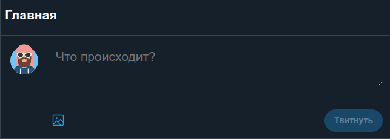

# Сервис микроблогов
***

## Структура проекта

### Функциональные требования

- Пользователь может добавить новый твит.
- Пользователь может удалить свой твит.
- Пользователь может зафоловить другого пользователя.
- Пользователь может отписаться от другого пользователя.
- Пользователь может отмечать твит как понравившийся.
- Пользователь может убрать отметку «Нравится».
- Пользователь может получить ленту из твитов отсортированных в порядке убывания по популярности от 
пользователей, которых он фоловит. 
- Твит может содержать картинку.

### Файлы и дерриктории
- client - директория с клиентским приложением, которое отвечает за взаимодействие с пользователем.
- server - директория с серверной частью приложения. Здесь находятся все API-эндпоинты, модели данных и логика обработки запросов.
- tests - директория с тестами серверной части.
- .env.template - шаблон переменных окружения.
- docker-compose.yaml - настройки docker-compose.
- requirements.txt - зависимости Python.
- requirements_prod.txt - зависимости Python для продакшн.

***

## Установка и запуск проекта

Склонировать проект:

```
git clone https://github.com/ezemskov24/social_network_backend.git
```
В репозитории хранится файл .env.template. Надо на его основе создать и заполнить файл .env 


### Для работы S3 хранилища необходимо:
- Войти/зарегестрироваться на сервисе, предоставляющим облачные инфраструктурные сервисы.
- Для текущего проекта был выбран Selectel.
```
https://my.selectel.ru/
```
- Создать публичное объектное хранилище.
- Добавить пользователя и дать права администратора.
- Сгенерировать ACCESS_KEY и SECRET_KEY.
- Скопировать ENDPOINT_URL и BUCKET_NAME.
- Скопировать адрес публичного домена.

***
Перед запуском проекта необходимо собрать контейнер командой:
```
docker compose build
```

Запуск проекта: 
```
docker compose up -d
```
***
